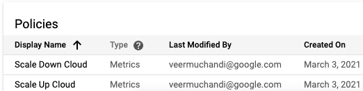

# Testing Cloud Bursting

Now it is time to test cloud bursting.

## Setup Cloud Monitoring Workspace

Set up cloud monitoring workspace as explained [here](https://cloud.google.com/monitoring/workspaces/create#single-project-workspace)

This will allow us to watch the monitoring and alerts that are fired.

## Navigate to Alerting to watch the workloads and events

From Google Cloud Console navigate to `Monitoring` -> `Alerting`

This is where you would watch scale up and scale down incidents fired as they come in.

Scroll down to Policies section to find both the policies. 


Click on Scale Up Cloud policy to get to the detailed page where the workload graph is seen along with the threshold where the alert will be triggered


## Deploy Memory Hogger Application

The following steps will create a kubernetes deployment that consumes a specified amount of memory per pod

```
mkdir memhog && cd memhog
cat > app.py <<EOF
#https://stackoverflow.com/questions/6317818/how-to-eat-memory-using-python
import os
import psutil
# print(psutil.virtual_memory())
PROCESS = psutil.Process(os.getpid())
MEGA = 10 ** 6
SIZE = os.getenv("MEMORY",5000)

def pmem():
    try:
        tot, avail, percent, used, free, active, inactive, buffers = psutil.virtual_memory()
    except ValueError:
        tot, avail, percent, used, free, active, inactive, buffers, cached, shared, slab = psutil.virtual_memory()
    tot, avail, used, free = tot / MEGA, avail / MEGA, used / MEGA, free / MEGA
    #tot, avail, used, free = tot, avail, used, free
    proc = PROCESS.memory_info()[1] #/ MEGA
    print('process = %s total = %s avail = %s used = %s free = %s percent = %s'
          % (proc, tot, avail, used, free, percent))

x = bytearray(1024*1024*int(SIZE))
while True:
  pmem()

print("Done")
EOF

cat > requirements.txt <<EOF
psutil>=2.0
EOF

```

Create a Dockerfile for the memory hog

```
cat > Dockerfile <<EOF
FROM python:3

COPY requirements.txt ./
RUN pip install --no-cache-dir -r requirements.txt

COPY app.py ./

CMD ["python3", "./app.py"]
EOF
```

Build and push an image for the service

```
export PROJECT_ID=$(gcloud config list --format \
  "value(core.project)")
export IMAGE_NAME=gcr.io/${PROJECT_ID}/memhog

docker build -t ${IMAGE_NAME} .
docker push ${IMAGE_NAME}
```

Create a kubernetes deployment manifest

```
kubectl create ns memhog

cat > deployment.yaml <<EOF
apiVersion: apps/v1
kind: Deployment
metadata:
  labels:
    app: memhog
  name: memhog
  namespace: memhog
spec:
  replicas: 75
  selector:
    matchLabels:
      app: memhog
  template:
    metadata:
      labels:
        app: memhog
    spec:
      containers:
      - image: ${IMAGE_NAME}
        name: memhog
        resources: 
          requests:
            memory: "1Gi"
        env:
        - name: MEMORY
          value: "1000"
EOF
```

## Test by generating workload

Open a new window and start curling the application at the loadbalancer. Note you may have to open up firewall to be able to reach the application.

```
while true;do curl $LB_IP; done; 
```
You will notice all traffic going to the on-prem cluster

```
Hello From Anthos On Prem!
Hello From Anthos On Prem!
Hello From Anthos On Prem!
Hello From Anthos On Prem!
Hello From Anthos On Prem!
Hello From Anthos On Prem!
Hello From Anthos On Prem!
Hello From Anthos On Prem!
Hello From Anthos On Prem!
Hello From Anthos On Prem!
Hello From Anthos On Prem!
Hello From Anthos On Prem!
```

Generate workload by creating the memhog application

```
kubectl apply -f deployment.yaml -n memhog
```

Watch the pods getting created as soon as you deploy this on the On-Prem cluster

```
 watch kubectl get pods -n memhog
```

You will notice a bunch of pods in Pending status as the resources would be insufficient

```
NAME                     READY   STATUS    RESTARTS   AGE
memhog-954d45dc7-2dcbt   1/1     Running   0          88s
memhog-954d45dc7-2qrl2   1/1     Running   0          88s
memhog-954d45dc7-2s4f2   1/1     Running   0          88s
memhog-954d45dc7-4bdvw   0/1     Pending   0          86s
memhog-954d45dc7-4t4lf   1/1     Running   0          88s
memhog-954d45dc7-4zv5k   0/1     Pending   0          86s
memhog-954d45dc7-58kpc   0/1     Pending   0          87s
memhog-954d45dc7-5f8m4   0/1     Pending   0          87s
memhog-954d45dc7-5pnbc   1/1     Running   0          88s
memhog-954d45dc7-5v6qx   1/1     Running   0          88s
memhog-954d45dc7-62xrm   0/1     Pending   0          87s
memhog-954d45dc7-64srf   0/1     Pending   0          87s
memhog-954d45dc7-6q969   1/1     Running   0          88s
memhog-954d45dc7-749sm   1/1     Running   0          88s
memhog-954d45dc7-7f5ps   1/1     Running   0          87s
memhog-954d45dc7-7ncjc   1/1     Running   0          87s
memhog-954d45dc7-8q96h   0/1     Pending   0          86s
memhog-954d45dc7-8vp2m   1/1     Running   0          88s
memhog-954d45dc7-99c25   1/1     Running   0          88s
memhog-954d45dc7-9k8zg   1/1     Running   0          88s
memhog-954d45dc7-9mvnx   1/1     Running   0          88s
memhog-954d45dc7-b9h85   0/1     Pending   0          86s
```

Switch back to the monitoring page to see the spike on the graph


In a couple of minutes you will notice the traffic distributed between to both the clusters

```
Hello From Anthos On Prem!
Hello From KubeRun on GCP!
Hello From Anthos On Prem!
Hello From Anthos On Prem!
Hello From Anthos On Prem!
Hello From KubeRun on GCP!
Hello From KubeRun on GCP!
Hello From Anthos On Prem!
Hello From Anthos On Prem!
Hello From Anthos On Prem!
Hello From Anthos On Prem!
Hello From Anthos On Prem!
Hello From KubeRun on GCP!
Hello From Anthos On Prem!
Hello From KubeRun on GCP!
Hello From KubeRun on GCP!
Hello From Anthos On Prem!
Hello From KubeRun on GCP!
Hello From Anthos On Prem!
Hello From Anthos On Prem!
Hello From KubeRun on GCP!
Hello From KubeRun on GCP!
Hello From Anthos On Prem!
Hello From Anthos On Prem!
```

Now delete the memory hogger

```
kubectl delete -f deployment.yaml -n memhog
```

You will notice an incident fired for Scale Down. In a few minutes the traffic will again be diverted to only the On-Prem cluster.


